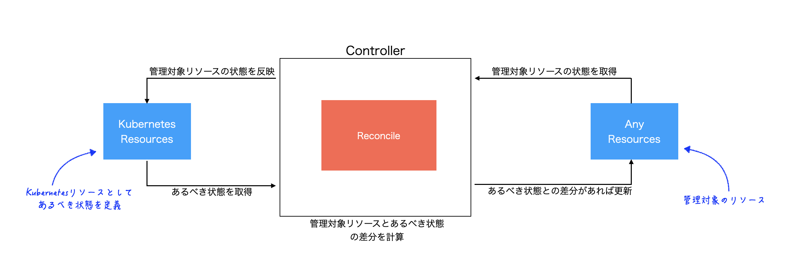
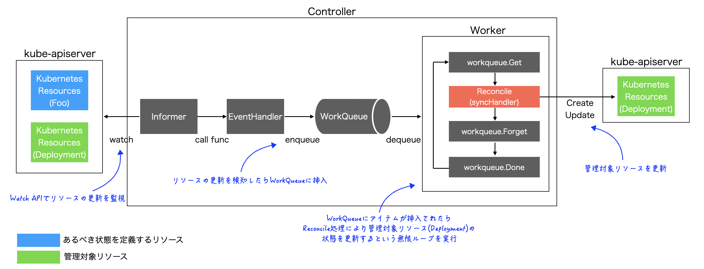
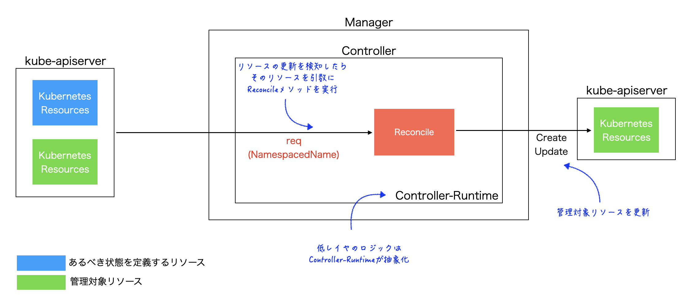
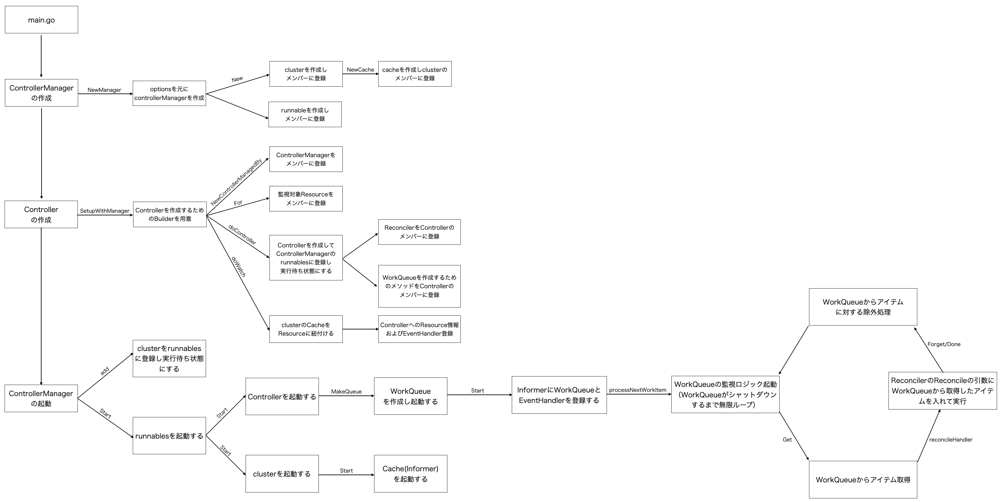

# Kubernetes First Contribution Road Map
## ゴール
Kubernetesおよび関連プロジェクトに対してContributionを開始できること。

## 習得すべきスキル
- Kubernetes関連コードを読んでどのような処理が行われているかを理解できる
- あるべき状態にコードを修正できる

## 対象者
Kubernetesの基本的な動作やコンポーネントを理解しており、Kubernetesおよび関連プロジェクトにコードベースのPRを出してみたい人。

#### 目安
- Kubernetesのコンポーネントおよび役割の概要を説明できる
  - [Kubernetes Components](https://kubernetes.io/docs/concepts/overview/components/)
- `Reconcile`とは何か概要を説明できる
  - [Controllers](https://kubernetes.io/docs/concepts/architecture/controller/)

## 事前準備
使用するエディタは好みで良いが、特にコードリーディングをする上でコード内で使用されている関数やメソッド、構造体定義を参照したくなる場面が多いため`VSCode`などコードジャンプを利用できるものを強く推奨。  

- [vscode-go/code-navigation](https://github.com/golang/vscode-go/wiki/features#code-navigation)

## 1. Go言語の基礎学習
### 1.1. 基礎文法の習得
Kubernetesの実装はGo言語が基本となるため、最低限の文法知識は必須。  
ただし時間をかけ過ぎる必要はないので、どんなに長くても2週間以内にはこのステップを終わらせる。  
※この後のステップで不明な文法に出会ったら都度調べたりサンプルコードを書いて知識を補完するというやり方が効率的

#### [参考]
- [Tour of Go](https://go.dev/tour/list)
- [プログラミング言語Go完全入門](https://docs.google.com/presentation/d/1RVx8oeIMAWxbB7ZP2IcgZXnbZokjCmTUca-AbIpORGk/edit#slide=id.g4f417182ce_0_0)

特にKubernetesでは以下の文法が頻出するので意識して学習すると良い。
- `interface`
- `goroutine`
- `channel`

### 1.2. テスト手法の習得
Kubernetes関連プロジェクトではUnitテストにGo標準の`testing`パッケージが用いられることもあるため、`testing`パッケージを用いた基本的なテストコードの書き方は押さえておく。  
ただし深掘りし過ぎる必要はなく、ネット検索すればいくらでも例は出てくるのでそれをなぞる程度で良い。  
因みにe2eテストでは`Ginkgo`/`Gomega`といったテストフレームワーク(`2.3`)が用いられるケースが多い。

- [testing](https://pkg.go.dev/testing)

## 2. Kubernetes実装の基礎学習
基礎学習として`Controller`に関するコードリーディングや実装を経験することで、Kubernetesのコアとなる`Reconcile`や、`kube-apiserver`に対するCRUDの仕組みを習得する。  
この知識は`Controller`に限らず様々なKubernetesコンポーネントの実装理解に活用できるものなのでこのステップで押さえておくと良い。

#### Controllerとは  
[Controller](https://kubernetes.io/docs/concepts/architecture/controller/)とは、管理対象とするなんらかのリソースの状態を、Kubernetesリソースとして定義したあるべき状態に維持する(`Reconcile`)コンポーネント。  
代表的な例としてKubernetes上で`ReplicaSet`を用いて複数`Pod`を管理する例が挙げられる。

特に`2.1`、`2.2`および`2.4`については以下書籍に沿って行うのがスムーズ。  
必要な知識を体系的かつ効率的に習得ことができるのを踏まえれば2,000円という価格は安い。  
- [実践入門 Kubernetesカスタムコントローラーへの道](https://nextpublishing.jp/book/11389.html)

### 2.1. sample-controllerのコードリーディング
`sample-controller`(`Controller`のリファレンス実装)のコードリーディングを通じて[client-go](https://pkg.go.dev/k8s.io/client-go/kubernetes)と呼ばれるパッケージを用いたプリミティブな`Controller`の実装方式を理解する。  
特に`Clientset`,`Informer`,`EventHandler`,`Queue`と言った重要コンポーネントの使い方や、それらを用いた`Reconcile`の実現方式に関する知識を習得するのがこのステップでの主な目的。

- [kubernetes/sample-controller](https://github.com/kubernetes/sample-controller)

書籍を用意できるようであれば[実践入門 Kubernetesカスタムコントローラーへの道](https://nextpublishing.jp/book/11389.html)の2、3章に沿って進めるのが理想的だが、用意が難しい場合は参考に挙げたサイトを参考にコードリーディングを行うと良い。

最終的に以下のようなイメージで`sample-controller`が動作するところまで理解できれば良い。  

#### [参考]
- [実践入門 Kubernetesカスタムコントローラーへの道](https://nextpublishing.jp/book/11389.html)の2、3章
- [sample-controllerを細かく解説する](https://zenn.dev/junya0530/articles/45f7a646f62f52)
- [client-go under the hood](https://github.com/kubernetes/sample-controller/blob/master/docs/controller-client-go.md)

### 2.2. KubebuilderによるControllerの実装
`Kubebuilder`(SDK)による`Controller`の実装を経験することで、[Controller-Runtime](https://pkg.go.dev/sigs.k8s.io/controller-runtime)と呼ばれるライブラリを用いた`Controller`の実装方式を理解する。  
特に`Controller-Runtime`では`client-go`を用いるケースと比較して`Reconcile`を実現するための低レイヤのロジックが抽象化されているため違いを意識しながら進めると良い。  
`kubernetes-sigs`や`3rd-Party`として提供される`Controller`は`Controller-Runtime`を用いて実装されているケースが多いためここで使い方を理解しておくと良い。

書籍を用意できるようであれば[実践入門 Kubernetesカスタムコントローラーへの道](https://nextpublishing.jp/book/11389.html)の4、5章に沿って進めるのが理想的だが、用意が難しい場合は参考に挙げたサイトを参考に、シンプルで良いのでなんらかの機能を持った`Controller`を実装する。

最終的に以下のようなイメージで`Controller`が動作するところまで理解できれば良い。  

#### [参考]
- [実践入門 Kubernetesカスタムコントローラーへの道](https://nextpublishing.jp/book/11389.html)の4、5章
- [Kubernetes Operator 超入](https://speakerdeck.com/oracle4engineer/kubernetes-operator-introduction)
  - [動画](https://youtu.be/kB8aof8Idg4?t=966)
- [つくって学ぶKubebuilder](https://zoetrope.github.io/kubebuilder-training/)
- [The Kubebuilder Book](https://book.kubebuilder.io/)

### 2.3. テスト
Kubernetes関連プロジェクトでは主にe2eテストにて`Ginkgo`/`Gomega`というテストフレームワークおよび`envtest`と呼ばれるパッケージ(テスト用に`kube-apiserver`と`etcd`を再現)がよく用いられる。  
Contributionを行う際にはソースコード本体に加えテストコードの記載や修正を行う必要があるためこのステップで理解しておく。  
全てのテストケースを網羅する必要はないので`2.2`で作成した`Controller`に対してテストコードを書いてみると良い。

#### [参考]
- [コントローラーのテスト](https://zoetrope.github.io/kubebuilder-training/controller-runtime/controller_test.html)
- [Ginkgo/GomegaによるKubernetes Operatorのテスト手法](https://zenn.dev/zoetro/books/testing-kubernetes-operator)

### 2.4. (Advanced)Webhookの実装
`kubernetes-sigs`や`3rd-Party`として提供される`Controller`では`Webhook`の機能が合わせて提供されることが多いため、`2.2`で作成したコントローラーに対して`Webhook`を実装し、実装方法を理解しておくと良い。  
※必要になったタイミングで補完するでも良い。

#### [参考]
- [実践入門 Kubernetesカスタムコントローラーへの道](https://nextpublishing.jp/book/11389.html)の7章
- [Webhookの実装](https://zoetrope.github.io/kubebuilder-training/controller-runtime/webhook.html)
- [Implementing defaulting/validating webhooks](https://book.kubebuilder.io/cronjob-tutorial/webhook-implementation.html)

### 2.5. (Advanced)Controller-Runtimeのコードリーディング
`Controller-Runtime`では`client-go`を用いる場合と比較して低レイヤのロジックが抽象化されるため、抽象化された部分が具体的にどのように実装されているかをコードリーディングから理解する。  
例として`kubebuilder`で初期化したプロジェクトの`Reconcile`メソッドがどのような流れで呼び出されるかを追ってみると良い。  
このステップは必須ではないが、`Controller-Runtime`に関する理解が深まるのに加えコードリーディング自体にも慣れることができるので実施することを推奨。

最終的に以下のようなイメージで`Controller`が起動し`Reconcile`が動作するところまで理解できれば良い。  

#### [参考]
- [controller-runtime Deep Dive](https://speakerdeck.com/bells17/controller-runtime-deep-dive)

## 3. Contributionの開始
Contributionを行うモチベーションとしては大きく以下2つ。  

#### Contributionのモチベーション
- ① OSS利用上の課題/問題の解決
  - 実際に業務等で特定のOSSを利用している中で発見した課題/問題に対してコードの修正を行う
  - 具体的なユースケースに基づいたContributionが行える
  - 自身で課題/問題の発見を行う必要がある
- ② OSS貢献という実績作り
  - 既存で上がっているissueに対してコードの修正を行う
  - Contributionという実績・経験が目的
  - 課題/問題を自分で見つける必要がない

一般的に①の考え方は理想的である反面、自分で対応すべき課題/問題を見つける必要があり最初のContributionとしては難易度が高くなりがち。(もちろん課題/問題がすでに見つかっているようであれば最初から①で進めても良い)  
②についてはContributionという行為自体が目的になってしまってはいるが、①と比較して着手しやすく将来的に①を目指す場合にも良いステップになるため、以降では初めてのContributionとして②を前提に解説する。

### 3.1. Contribution事前知識のインプット
Kubernetes関連のプロジェクトにContributeする際には一定のルールがあるため以下にざっと目を通しておくと良い。  
ただし読んで100%理解しようとすると難しいので詳細は必要になった時に都度参照するのが良い。  
[CLA(The Contributor License Agreement)](https://github.com/kubernetes/community/blob/master/CLA.md)についてはPRを出す際に必須となるためここでサインアップしておく。  

- [Kubernetesコントリビューターチートシート](https://github.com/kubernetes/community/blob/master/contributors/guide/contributor-cheatsheet/README-ja.md)
- [Contributing](https://github.com/kubernetes/community/blob/master/contributors/guide/contributing.md)

また、各種イベント開催に伴いUpstream Trainingが開催されることもあり、一度参加しておくとContributionの大まかな流れが掴みやすい。   
タイミングが合えば参加しておくと良い。

- [Kubernetes Upstream Training](https://github.com/kubernetes-sigs/contributor-playground/blob/master/japan/assets/slide.pdf)

### 3.2. Contribution対象の選定
Contributionを行うにあたりターゲットとするプロジェクトを選択する。    
あらかじめターゲットが定まっていれば良いが、定まっていない場合や難易度が高過ぎる場合は以下の観点を参考にすると良い。

ターゲット選定時の観点
- プロジェクトがアクティブであること
  - 非アクティブなブロジェクトだとPRを出しても対応してもらえない可能性がある
    - 最終Commit日時が数ヶ月以内か
    - 数ヶ月以内にissueやPRの更新があるか
    - 複数のPRが長期間確認待ちで止まっていないか
    - assignされていないissueがあるか
    - Contributor数はどの程度か(競争相手が多すぎないか)
- プロジェクトの利用イメージが持てること
  - プロジェクトのREADMEなどを見てなんとなくどんなプロジェクトか理解できるか
  - 利用したことがあるプロジェクトだとベター
- issueを見た時に問題のイメージの湧くものがあるか
  - 現在上がっているissueからターゲットを決めてコード修正を行うことになるので、ぱっと見イメージが湧かなそうであれば他のプロジェクトを選ぶことも検討する
- 実装イメージが持てるか
  - なんとなくで良いので「この辺りで`Reconcile`を行っていそう」などイメージが持てるか
- `Controller-Runtime`を用いて実装されているプロジェクト
  - ここまでの流れを追っていると`Controller-Runtime`を用いて実装されたプロジェクトは比較的実装を読み解きやすいはず
    - [kueue](https://github.com/kubernetes-sigs/kueue)
    - [security-profiles-operator](https://github.com/kubernetes-sigs/security-profiles-operator)
    - [hierarchical-namespaces](https://github.com/kubernetes-sigs/hierarchical-namespaces)
    - [aws-load-balancer-controller](https://github.com/kubernetes-sigs/aws-load-balancer-controller)

### 3.3. 基本動作の確認
ターゲットを決めたらまずは実際に動かして基本動作を確認する。  
Quick Start等がプロジェクトの`docs`に含まれているケースが多いのでそれらを参照しながら進める。  
また、動作確認はログを見ながら行うと実装イメージがつきやすい。  

### 3.4. 対応するissueの決定
`3.3`のステップを経てissue一覧を確認し、対応できそうなものをターゲットとして選択する。   
issueを選択したら実際に問題となっている事象を再現させてみて問題を具体的に理解する。

#### issueを探す時の観点
- バグ修正から手をつける
  - バグ修正は比較的部分的なコード修正で完結できる可能性が高い
  - issueはバグ報告以外のものもあるため`kind/bug`といったラベルを参考にすると良い
- 再現手順やあるべき姿が明確に示されているものを選ぶ
  - (例1: kubelet)[Pod terminating stuck because of trying to umount not actual mounted dir](https://github.com/kubernetes/kubernetes/issues/114546)
  - (例2: HNC)[Unable to delete Subnamespaceanchor with long name](https://github.com/kubernetes-sigs/hierarchical-namespaces/issues/230)

### 3.5. プロジェクトビルド方法の確認
対象プロジェクトのソースコードをローカルにcloneしたらビルドする手順を確認し、実際に動作させてみる。  
実際にコードを修正した後の動作確認はソースコードをビルドしてから行うことになるのに加え、デバッグにも役立つためこのステップでやり方を押さえておくと良い。  

### 3.6. コードリーディング
ローカルにcloneしたソースコードを読み進める。  
満遍なくコードを読むのはそれなりに大変なので、ある程度ターゲットを絞って読むと良い。  
  
#### コードリーディングの進め方
- メインの機能を中心に読み進める
- ターゲットのissueに関する流れを追う

#### コードリーディングのポイント
全てをコードだけから理解しようとしなくても良い。  
主な目的はメイン機能や特定のissueについてコードの流れを追えること。(≠コードを隅々まで理解する)

- 深追いしすぎない
  - 目的を果たす上で全てのロジックを完全に理解する必要はない
  - メソッドの中でメソッドが呼ばれて・・・を追い続けているとキリがないため、ある程度何をやってるか掴めたところで止める
- 既存のドキュメントを活用する
  - 概念的な説明や機能についてはドキュメントに書いてある場合がある
  - 「頑張ってコード読んだら実はドキュメントに書いてありました」はよくあること
- デバッグする
  - ロジックがコードから追いきれなければ実際にプロジェクトのソースコードにデバッグコードを仕込んで確認する
  - 副次的効果としてプロジェクトコードに手を入れることへの抵抗が薄れる
- PoCコードを書く
  - コードを読んでいて文法上よくわからない箇所があれば、その文法を用いたPoCコードを書いて動かしてみる
  - 目的意識がある状態なのでGo言語の文法知識補完が行いやすい

### 3.7. コードの修正とissue/PR
なんとなく修正の見込みが経ったら対象のissueに自分自身をアサインし(`/assign`)、
コードを修正してプロジェクトにPRを出す。  
修正に伴い気になることがあればissueのコメントで起票者に確認すると良い。  
また、プロジェクト内でContributionガイドが提供されているケースも多いのでPRを出す際はそちらにも目を通しておく。

## 発展
### Controller以外のコードリーディング
ここまでの流れを経験していると`Controller`以外の`Scheduler`や`kubelet`と言ったコンポーネントについても既存知識をベースに読み進めることができるはず。  
特に`2.1`の`sample-controller`で登場した`Clientset`,`Informer`,`EventHandler`,`Queue`と言った知識はほぼそのまま流用できる。

(例)
- [自作して学ぶKubernetes Scheduler](https://engineering.mercari.com/blog/entry/20211220-create-your-kube-scheduler/)
- [kubelet](https://github.com/kubernetes/kubernetes/blob/master/cmd/kubelet/kubelet.go)

## おわりに
ここまでの流れを終えると冒頭で設定した「Kubernetesおよび関連プロジェクトに対してContributionを開始できること。」というゴールは概ね達成できているはず。  
以下参考リンクでは本ドキュメントで取り上げなかった観点についても触れられているので必要に応じて参照すること。  
特に動画「OSSへの貢献をはじめたきっかけ、貢献で得たもの、やりたい人へのアドバイス」でも言われている

> 「最初の一歩」を踏み出すと後はどんどん先に進める傾向にある

という点は経験上間違いないので最初の1回は粘り強く取り組むと良い。

- [OSSへの貢献をはじめたきっかけ、貢献で得たもの、やりたい人へのアドバイス](
https://www.youtube.com/watch?v=L9gz8Xbaek0)
- [Kubernetesのコードリーディングをする上で知っておくと良さそうなこと](https://bells17.medium.com/things-you-should-know-about-reading-kubernetes-codes-933b0ee6181d)